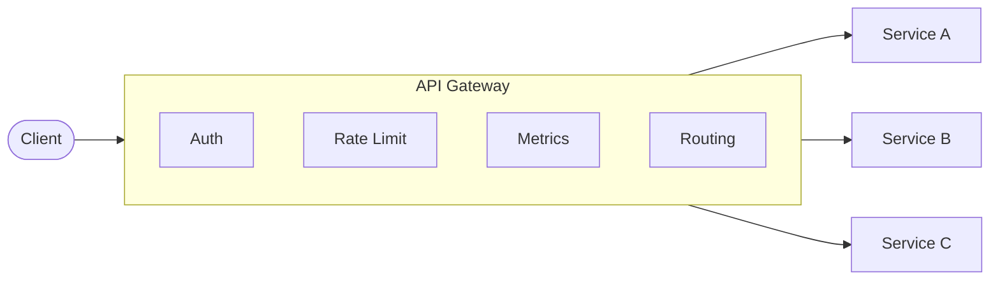
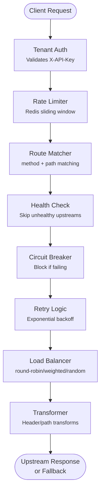

# Multi-tenant API Gateway

[](https://github.com/maumercado/gateway-api/actions/workflows/ci.yml)
[](https://www.typescriptlang.org/)
[](https://nodejs.org/)
[](https://fastify.dev/)
[](./LICENSE)

A production-ready, multi-tenant API Gateway built with Node.js, TypeScript, and Fastify. This project serves as both a functional gateway and a **learning resource** for understanding API gateway patterns.

## What is an API Gateway?

An API Gateway is a server that acts as the single entry point for all client requests to your backend services. Instead of clients calling multiple microservices directly, they call the gateway, which:

- **Routes requests** to the appropriate backend service
- **Authenticates** requests (validates API keys, tokens)
- **Rate limits** to prevent abuse
- **Transforms** requests/responses (add headers, rewrite paths)
- **Provides resilience** (retries, circuit breakers, fallbacks)
- **Collects metrics** for observability



## Learning Guide: Architectural Layers

This gateway was built in layers, each adding a key capability. Study each layer to understand API gateway concepts:

### Layer 1: Foundation

**Concepts:** Multi-tenancy, API key authentication, basic proxying

- **Multi-tenancy**: Each tenant (customer) has isolated routes and API keys. Tenants share the gateway infrastructure but can't see each other's data.
- **API Key Auth**: Incoming requests include `X-API-Key` header. The gateway validates against hashed keys in PostgreSQL, with Redis caching to reduce DB load.
- **Proxying**: The gateway forwards requests to upstream services using Node's native `fetch`. It adds headers like `x-forwarded-for` and `x-tenant-id`.

### Layer 2: Traffic Management

**Concepts:** Rate limiting, load balancing, path matching, transformations

- **Rate Limiting**: Uses Redis sliding window algorithm to count requests per tenant. Prevents any single tenant from overwhelming the system.
- **Load Balancing**: Distributes requests across multiple upstreams using round-robin, weighted random, or random strategies.
- **Path Matching**: Supports exact (`/api/users`), prefix (`/api/*`), and regex patterns to route requests to different backends.
- **Transformations**: Modifies requests (add/remove headers, rewrite paths) before forwarding and responses before returning to clients.

### Layer 3: Resilience

**Concepts:** Circuit breakers, retries, health checks, fallbacks

- **Circuit Breaker**: Stops sending requests to failing services. States: CLOSED (normal) → OPEN (blocking) → HALF_OPEN (testing recovery). Prevents cascading failures. Learn more: [The Circuit Breaker](https://maumercado.com/journal/the-circuit-breaker).
- **Retry with Backoff**: Automatically retries failed requests with exponential delays (1s, 2s, 4s...) plus jitter to prevent thundering herd.
- **Health Checks**: Background tasks that periodically ping upstream `/health` endpoints. Unhealthy services are skipped during routing.
- **Fallbacks**: Returns cached/static responses when upstreams fail, so clients get useful error messages instead of timeouts.

### Layer 4: Observability

**Concepts:** Metrics collection, Prometheus integration, multi-tenant monitoring

- **Prometheus Metrics**: Exposes `/metrics` endpoint with counters (requests, errors), histograms (latency), and gauges (active connections, circuit breaker state).
- **Multi-tenant Labels**: All metrics include `tenant_id` label, enabling per-tenant dashboards and alerts.
- **Histogram Buckets**: Latency histograms use fine-grained buckets (1ms to 10s) for accurate percentile calculations (p50, p95, p99).

## Tech Stack

- **Runtime:** Node.js 24+ with TypeScript 5+
- **Framework:** Fastify
- **Database:** PostgreSQL with Drizzle ORM
- **Cache:** Redis (ioredis)
- **Validation:** Zod
- **Testing:** Vitest
- **Package Manager:** pnpm

## Prerequisites

- Node.js 24+
- pnpm 10+
- Docker & Docker Compose (for local development)

## Getting Started

### 1. Install Dependencies

```bash
pnpm install
```

### 2. Start Infrastructure

```bash
docker compose up -d
```

This starts PostgreSQL and Redis containers.

### 3. Configure Environment

```bash
cp .env.example .env
# Edit .env with your configuration
```

### 4. Run Database Migrations

```bash
pnpm db:migrate
```

### 5. Seed the Database (Optional)

```bash
pnpm db:seed
```

This creates a test tenant with API key `test-api-key-12345` and sample routes. Useful for local development and testing.

### 6. Start Development Server

```bash
pnpm dev
```

The gateway will be available at `http://localhost:3000`.

## Available Scripts

| Script | Description |
|--------|-------------|
| `pnpm dev` | Start development server with hot reload |
| `pnpm build` | Build TypeScript to JavaScript |
| `pnpm start` | Run production build |
| `pnpm test` | Run tests (single run) |
| `pnpm test:watch` | Run tests in watch mode |
| `pnpm test:coverage` | Run tests with coverage |
| `pnpm lint` | Run ESLint |
| `pnpm lint:fix` | Fix auto-fixable lint issues |
| `pnpm format` | Format code with Prettier |
| `pnpm db:generate` | Generate Drizzle migrations |
| `pnpm db:migrate` | Run database migrations |
| `pnpm db:studio` | Open Drizzle Studio |
| `pnpm db:seed` | Seed database with sample data |

## Project Structure

```
src/
├── modules/                    # Domain modules
│   ├── tenant/                 # Tenant management (CRUD, auth)
│   │   ├── tenant.schema.ts    # Database schema (Drizzle)
│   │   ├── tenant.repository.ts # Data access layer
│   │   ├── tenant.service.ts   # Business logic
│   │   ├── tenant.routes.ts    # HTTP routes
│   │   └── tenant.types.ts     # TypeScript types
│   └── routing/                # Route matching & proxying
│       ├── routing.schema.ts
│       ├── routing.repository.ts
│       ├── routing.service.ts
│       ├── routing.handler.ts  # Proxy handler with resilience
│       ├── routing.routes.ts
│       └── routing.types.ts
├── plugins/                    # Fastify plugins
│   ├── admin-auth.ts           # Admin API key validation
│   ├── database.ts             # PostgreSQL connection
│   ├── health-check.ts         # Upstream health monitoring
│   ├── metrics.ts              # Prometheus metrics endpoint
│   ├── rate-limit.ts           # Per-tenant rate limiting
│   ├── redis.ts                # Redis connection
│   ├── routing-service.ts      # Routing service injection
│   ├── tenant-auth.ts          # Tenant API key validation
│   └── tenant-service.ts       # Tenant service injection
├── shared/                     # Shared utilities
│   ├── circuit-breaker/        # Circuit breaker pattern
│   ├── config/                 # Environment configuration
│   ├── database/               # Drizzle client & schema
│   ├── fallback/               # Fallback response generation
│   ├── health-check/           # Upstream health checking
│   ├── load-balancer/          # Load balancing strategies
│   ├── metrics/                # Prometheus metrics definitions
│   ├── rate-limiter/           # Sliding window rate limiter
│   ├── redis/                  # Redis client
│   ├── retry/                  # Retry with exponential backoff
│   ├── transformer/            # Request/response transformation
│   └── types/                  # Shared TypeScript types
├── gateway.ts                  # Main Fastify server
└── index.ts                    # Entry point
```

## Architecture

### Overview

The gateway uses a **modular monolith** architecture with clear separation:

- **Modules**: Domain logic (tenant, routing)
- **Plugins**: Fastify integration with dependency injection
- **Shared**: Reusable utilities across modules

### Request Flow



### Dependency Injection

Services use factory functions for testability:

```typescript
// Repository accepts db client
const repository = createTenantRepository(db);

// Service accepts dependencies
const service = createTenantService({ repository, redis });

// Plugin injects from Fastify instance
fastify.decorate('tenantService', service);
```

### Plugins

| Plugin | Purpose | Dependencies |
|--------|---------|--------------|
| `database` | Manages PostgreSQL connection lifecycle | - |
| `redis` | Manages Redis connection lifecycle | - |
| `metrics` | Exposes Prometheus metrics endpoint | redis |
| `tenant-service` | Provides tenant CRUD operations | database, redis |
| `routing-service` | Provides route matching and CRUD | database |
| `health-check` | Monitors upstream health | redis, routing-service |
| `tenant-auth` | Validates tenant API keys | tenant-service |
| `admin-auth` | Validates admin API key | - |
| `rate-limit` | Enforces per-tenant rate limits | redis, tenant-service |

### Resilience Features

All resilience features are **opt-in** per route via the `resilience` field:

#### Circuit Breaker

Prevents cascading failures by stopping requests to failing upstreams. For a deep dive into the circuit breaker pattern, see [The Circuit Breaker](https://maumercado.com/journal/the-circuit-breaker).

- **CLOSED**: Normal operation, requests flow through
- **OPEN**: Requests blocked after `failureThreshold` failures
- **HALF_OPEN**: Limited requests allowed after `timeout` expires
- State stored in Redis for distributed deployments

#### Retry Policy

Automatically retries failed requests with exponential backoff.

- Configurable `maxRetries`, `baseDelayMs`, `maxDelayMs`
- Jitter added to prevent thundering herd
- Only retries on `retryableStatusCodes` (default: 500, 502, 503, 504)

#### Health Checks

Actively probes upstream health endpoints.

- Periodic HTTP GET to configured `endpoint`
- Tracks consecutive successes/failures
- Marks upstream unhealthy after `unhealthyThreshold` failures
- Healthy again after `healthyThreshold` successes

#### Configurable Timeouts

Per-route and per-method timeout configuration.

- Global default timeout
- Method-specific overrides (e.g., longer for POST)
- Falls back to upstream timeout if not configured

#### Fallback Responses

Returns cached/static response when upstream fails.

- Configurable status code, content type, body
- Supports JSON, HTML, and plain text
- Used when circuit breaker open or all retries exhausted

### Route Configuration Example

```json
{
  "method": "GET",
  "path": "/api/users",
  "pathType": "prefix",
  "upstreams": [
    { "url": "http://users-service:3000", "weight": 3 },
    { "url": "http://users-backup:3000", "weight": 1 }
  ],
  "loadBalancing": "weighted",
  "resilience": {
    "circuitBreaker": {
      "enabled": true,
      "failureThreshold": 5,
      "successThreshold": 2,
      "timeout": 30000
    },
    "retry": {
      "enabled": true,
      "maxRetries": 3,
      "baseDelayMs": 1000,
      "retryableStatusCodes": [500, 502, 503, 504]
    },
    "timeout": {
      "default": 10000,
      "byMethod": { "GET": 5000, "POST": 30000 }
    },
    "healthCheck": {
      "enabled": true,
      "endpoint": "/health",
      "intervalMs": 30000,
      "timeoutMs": 5000,
      "healthyThreshold": 2,
      "unhealthyThreshold": 3
    },
    "fallback": {
      "enabled": true,
      "statusCode": 503,
      "contentType": "application/json",
      "body": "{\"error\":\"Service temporarily unavailable\"}"
    }
  }
}
```

## API Endpoints

### Health Check (No Auth)

```bash
curl http://localhost:3000/health   # Gateway health
curl http://localhost:3000/ready    # Gateway readiness
```

### Metrics Endpoint (No Auth)

```bash
curl http://localhost:3000/metrics  # Prometheus metrics
```

### Admin API (X-Admin-Key Required)

```bash
# Tenants
GET    /admin/tenants              # List all tenants
GET    /admin/tenants/:id          # Get tenant by ID
POST   /admin/tenants              # Create tenant
PATCH  /admin/tenants/:id          # Update tenant
DELETE /admin/tenants/:id          # Delete tenant

# Routes
GET    /admin/tenants/:id/routes   # List routes for tenant
GET    /admin/routes/:id           # Get route by ID
POST   /admin/routes               # Create route
PATCH  /admin/routes/:id           # Update route
DELETE /admin/routes/:id           # Delete route
```

### Proxy Requests (X-API-Key Required)

All other requests proxy to configured upstreams:

```bash
curl -H "X-API-Key: your-tenant-key" http://localhost:3000/your-route
```

Response headers include rate limit info:

- `X-RateLimit-Limit` - Maximum requests allowed
- `X-RateLimit-Remaining` - Remaining requests in window
- `X-RateLimit-Reset` - Unix timestamp when limit resets

## Environment Variables

| Variable | Description | Default |
|----------|-------------|---------|
| `PORT` | Server port | `3000` |
| `NODE_ENV` | Environment | `development` |
| `DATABASE_URL` | PostgreSQL connection URL | - |
| `REDIS_URL` | Redis connection URL | - |
| `ADMIN_API_KEY` | Admin API key | - |
| `LOG_LEVEL` | Pino log level | `info` |
| `METRICS_ENABLED` | Enable Prometheus metrics | `true` |
| `TRACING_ENABLED` | Enable OpenTelemetry tracing | `false` |
| `TRACING_ENDPOINT` | OTLP exporter endpoint | - |

## Redis Key Patterns

| Feature | Key Pattern | TTL |
|---------|-------------|-----|
| Tenant Cache | `tenant:apikey:{key}` | 5s |
| Rate Limit | `ratelimit:{tenantId}` | 1s |
| Circuit Breaker | `cb:{tenantId}:{routeId}:{urlHash}` | timeout + 60s |
| Health Status | `health:{tenantId}:{routeId}:{urlHash}` | interval × 3 |

## Observability

### Prometheus Metrics

The gateway exposes a `/metrics` endpoint that returns Prometheus-formatted metrics. No authentication is required (standard for Prometheus scraping).

#### Available Metrics

| Metric | Type | Labels | Description |
|--------|------|--------|-------------|
| `gateway_http_requests_total` | Counter | tenant_id, method, route, status_code | Total HTTP requests received |
| `gateway_http_request_duration_seconds` | Histogram | tenant_id, method, route | Request latency (supports p50, p95, p99) |
| `gateway_upstream_requests_total` | Counter | tenant_id, upstream, method, status_code | Total upstream requests made |
| `gateway_upstream_request_duration_seconds` | Histogram | tenant_id, upstream, method, status_code | Upstream request latency |
| `gateway_active_connections` | Gauge | - | Current active connections |
| `gateway_circuit_breaker_state` | Gauge | tenant_id, route_id, upstream | Circuit state (0=closed, 1=open, 2=half_open) |
| `gateway_circuit_breaker_transitions_total` | Counter | tenant_id, route_id, upstream, from_state, to_state | State transitions |
| `gateway_rate_limit_hits_total` | Counter | tenant_id | Requests blocked by rate limiting |
| `gateway_rate_limit_remaining` | Gauge | tenant_id | Remaining rate limit allowance |
| `gateway_health_check_status` | Gauge | tenant_id, route_id, upstream | Upstream health (0=unhealthy, 1=healthy) |
| `gateway_retry_attempts_total` | Counter | tenant_id, route_id, attempt | Retry attempts made |

Default Node.js metrics (memory, CPU, event loop) are also included.

#### Example Prometheus Queries

```promql
# Request rate by tenant (requests per second)
rate(gateway_http_requests_total[5m])

# P95 latency by route
histogram_quantile(0.95, rate(gateway_http_request_duration_seconds_bucket[5m]))

# Error rate (5xx responses)
sum(rate(gateway_http_requests_total{status_code=~"5.."}[5m]))
  / sum(rate(gateway_http_requests_total[5m]))

# Circuit breakers currently open
sum(gateway_circuit_breaker_state == 1) by (tenant_id, upstream)

# Rate limit hits per tenant
rate(gateway_rate_limit_hits_total[5m])

# Unhealthy upstreams
gateway_health_check_status == 0

# Average upstream latency by service
rate(gateway_upstream_request_duration_seconds_sum[5m])
  / rate(gateway_upstream_request_duration_seconds_count[5m])
```

### Quick Start: Observability Stack

The project includes a **plug-and-play** observability stack with pre-configured Prometheus and Grafana:

```bash
# 1. Start the gateway
pnpm dev

# 2. Start observability stack (in another terminal)
docker compose -f docker-compose.observability.yml up -d
```

**Access the tools:**

- **Prometheus**: <http://localhost:9090> - Query metrics directly
- **Grafana**: <http://localhost:3001> - Visualize dashboards (login: admin/admin)

The Grafana dashboard is **pre-loaded** with panels for:

- Request rate and error rate
- P50/P95/P99 latency percentiles
- Request rate by tenant and status code
- Upstream latency by service
- Circuit breaker states (CLOSED/OPEN/HALF_OPEN)
- Rate limit hits per tenant
- Upstream health status
- Node.js heap memory and event loop lag

**Files included:**

- `prometheus.yml` - Scrape configuration
- `docker-compose.observability.yml` - Prometheus + Grafana services
- `grafana/dashboards/api-gateway.json` - Pre-built dashboard
- `grafana/provisioning/` - Auto-configuration for datasources and dashboards

### Generate Test Traffic

To see data in the dashboards, generate traffic using the load test script:

```bash
# Basic load test (100 requests, 10 concurrent)
pnpm load-test

# Custom load test
pnpm load-test -- --requests 500 --concurrency 20 --delay 100
```

**Options:**

| Flag | Default | Description |
|------|---------|-------------|
| `--requests` | 100 | Total number of requests to send |
| `--concurrency` | 10 | Number of concurrent requests |
| `--delay` | 50 | Delay (ms) between batches |

The script hits various endpoints including some that return errors (400, 500), so you'll see error rates and can observe circuit breaker behavior in the dashboards.

**Prerequisites:**

1. Gateway running (`pnpm dev`) - see [Getting Started](#getting-started)
2. Database seeded (`pnpm db:seed`) - creates test tenant with API key `test-api-key-12345`
3. Observability stack running (see above)

### Using Prometheus UI

Access Prometheus at **<http://localhost:9090>**. Enter queries in the search box and click "Execute".

**Tips:**

- Click **Graph** tab to see time series visualization
- Click **Table** tab for instant values
- Metric names autocomplete as you type
- Use `[5m]` suffix for rate calculations (5-minute window)

#### Basic Queries

```promql
# Total requests (instant value)
gateway_http_requests_total

# Request rate per second (over last 5 min)
rate(gateway_http_requests_total[5m])

# Total requests grouped by status code
sum by (status_code) (gateway_http_requests_total)

# Total requests grouped by tenant
sum by (tenant_id) (gateway_http_requests_total)
```

#### Latency Queries

```promql
# P50 latency (median)
histogram_quantile(0.50, rate(gateway_http_request_duration_seconds_bucket[5m]))

# P95 latency
histogram_quantile(0.95, rate(gateway_http_request_duration_seconds_bucket[5m]))

# P99 latency
histogram_quantile(0.99, rate(gateway_http_request_duration_seconds_bucket[5m]))

# Average latency
rate(gateway_http_request_duration_seconds_sum[5m])
  / rate(gateway_http_request_duration_seconds_count[5m])
```

#### Error Rate Queries

```promql
# 5xx error count
sum(gateway_http_requests_total{status_code=~"5.."})

# 5xx error rate as percentage
sum(rate(gateway_http_requests_total{status_code=~"5.."}[5m]))
  / sum(rate(gateway_http_requests_total[5m])) * 100

# Errors by tenant
sum by (tenant_id) (rate(gateway_http_requests_total{status_code=~"5.."}[5m]))
```

#### Resilience Queries

```promql
# Circuit breaker states (0=closed, 1=open, 2=half_open)
gateway_circuit_breaker_state

# Circuit breakers currently open
gateway_circuit_breaker_state == 1

# Rate limit hits per tenant
sum by (tenant_id) (rate(gateway_rate_limit_hits_total[5m]))

# Unhealthy upstreams
gateway_health_check_status == 0

# Retry attempts
sum by (tenant_id) (rate(gateway_retry_attempts_total[5m]))
```

### Example: Monitoring a Tenant

To monitor a specific tenant (e.g., `tenant-abc123`) in Prometheus:

```promql
# All requests for this tenant
gateway_http_requests_total{tenant_id="tenant-abc123"}

# This tenant's error rate
sum(rate(gateway_http_requests_total{tenant_id="tenant-abc123", status_code=~"5.."}[5m]))
  / sum(rate(gateway_http_requests_total{tenant_id="tenant-abc123"}[5m]))

# This tenant's P99 latency
histogram_quantile(0.99,
  rate(gateway_http_request_duration_seconds_bucket{tenant_id="tenant-abc123"}[5m])
)

# Check if this tenant is being rate limited
rate(gateway_rate_limit_hits_total{tenant_id="tenant-abc123"}[5m])
```

## License

MIT
