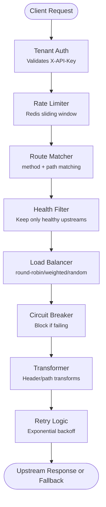

# Building a Production-Ready API Gateway from Scratch with Node.js & TypeScript

Most teams should reach for Kong, AWS API Gateway, or another managed option when they need a gateway. That is usually the right engineering decision.

But building one yourself once is a different kind of education. It forces every trade-off into the open: where state lives, how failures propagate, what gets cached, and which guarantees are real versus assumed.

This post is a teardown of [gateway-api](https://github.com/maumercado/gateway-api), a multi-tenant API gateway built with Node.js 24, TypeScript, Fastify 5, PostgreSQL, and Redis. I built it in four layers: foundation, traffic management, resilience, and observability. Each layer adds one set of responsibilities you would expect from something approaching production infrastructure.

**Stack:** Node.js 24+ · TypeScript 5.9 · Fastify 5.x · PostgreSQL + Drizzle ORM · Redis (ioredis) · prom-client · Zod · Vitest

---

## Architecture Overview

The project uses a **modular monolith**: domain logic lives in `src/modules/` (tenant management, route management), shared utilities in `src/shared/` (circuit breaker, retry, rate limiter, load balancer, health checker, metrics), and Fastify plugins in `src/plugins/` for wiring everything together.

Every incoming request follows this request path in the current implementation:



That diagram is the runtime view. The wiring view is different: Fastify plugin registration order matters because infrastructure plugins have to exist before the services and hooks that depend on them. I will come back to that in the lessons learned section.

**Multi-tenancy model:** Each tenant has its own API keys and route configuration in PostgreSQL. The infrastructure is shared, but every request is scoped to a tenant as soon as the API key is validated.

---

## Layer 1: Foundation — Auth & Proxying

This is the minimum bar for calling something a gateway instead of just a reverse proxy: identify the caller, resolve the route, and forward the request cleanly.

### API Key Authentication

Authentication uses the `X-API-Key` header. Keys are bcrypt-hashed in PostgreSQL. The gateway validates incoming keys against all active tenants, then caches successful lookups in Redis for 5 seconds (`tenant:apikey:{key}`) to avoid hitting the database on every request.

At the Fastify layer, auth is exposed as a decorator-backed `preHandler` hook ([`src/plugins/tenant-auth.ts`](https://github.com/maumercado/gateway-api/blob/main/src/plugins/tenant-auth.ts)):

```typescript
declare module 'fastify' {
  interface FastifyRequest {
    tenant?: Tenant; // Type-safe tenant injection
  }
  interface FastifyInstance {
    tenantAuth: (request: FastifyRequest, reply: FastifyReply) => Promise<void>;
  }
}

fastify.decorate('tenantAuth', async function (request, reply) {
  const apiKey = request.headers['x-api-key'];

  if (!apiKey || typeof apiKey !== 'string') {
    return reply.status(401).send({ error: 'Unauthorized', message: 'Missing or invalid X-API-Key header' });
  }

  const tenant = await tenantService.validateApiKey(apiKey);

  if (!tenant) return reply.status(401).send({ error: 'Unauthorized', message: 'Invalid API key' });
  if (!tenant.isActive) return reply.status(403).send({ error: 'Forbidden', message: 'Tenant account is inactive' });

  request.tenant = tenant; // Available to all downstream handlers
});
```

Fastify's module augmentation makes the rest of the request pipeline cleaner: once auth succeeds, `request.tenant` is fully typed everywhere downstream.

### Request Proxying

The proxying side deliberately stays simple. It uses Node's native `fetch` API instead of pulling in `http-proxy` or `node-http-proxy`. On every request the handler:

1. Matches the route by tenant ID, HTTP method, and path (exact or prefix)
2. Selects an upstream via the load balancer
3. Forwards the original headers plus `x-forwarded-for`, `x-forwarded-host`, `x-forwarded-proto`, and `x-tenant-id`
4. Streams the upstream response back to the client (piped as a Node.js Readable, no body buffering)

---

## Layer 2: Traffic Management — Rate Limiting & Load Balancing

Once the basics work, the gateway needs to make decisions about traffic: how much to allow, and where to send it.

### Sliding Window Rate Limiting with Redis Sorted Sets

The rate limiter uses a sliding window algorithm built on Redis sorted sets. The key idea is simple: if timestamps are scores, Redis can answer "how many requests happened in the last second?" without the boundary artifacts you get from fixed windows.

From [`src/shared/rate-limiter/index.ts`](https://github.com/maumercado/gateway-api/blob/main/src/shared/rate-limiter/index.ts):

```typescript
export async function checkRateLimit(key: string, config: RateLimitConfig): Promise<RateLimitResult> {
  const now = Date.now();
  const windowStart = now - 1000; // 1-second window
  const limit = config.burstSize ?? config.requestsPerSecond;
  const redisKey = `ratelimit:${key}`;

  // Single Lua script: all operations execute atomically in one round trip.
  // ZREMRANGEBYSCORE + ZCARD + conditional ZADD + ZRANGE for reset time.
  const result = await redis.eval(RATE_LIMIT_SCRIPT, 1, redisKey,
    now, windowStart, limit, member, ttl
  ) as [number, number, number, number];

  const [allowedInt, remaining, oldestScore] = result;
  return {
    allowed: allowedInt === 1,
    remaining,
    resetAt: oldestScore + windowMs,
    limit,
  };
}
```

When a request is blocked, the response includes `Retry-After` so clients know when to try again. The default tenant limit is 100 req/s with a burst capacity of 150.

### Three Load Balancing Strategies

Each route chooses its load balancing strategy in the database. Three are available:

**Round-robin** cycles through upstreams in order, maintaining an in-memory counter per route ID:

```typescript
function selectRoundRobin(upstreams: UpstreamConfig[], routeId: string): UpstreamConfig {
  const currentIndex = roundRobinCounters.get(routeId) ?? 0;
  roundRobinCounters.set(routeId, currentIndex + 1);
  return upstreams[currentIndex % upstreams.length]!;
}
```

**Weighted** uses probability-based selection via cumulative weight ranges. A `[{ weight: 3 }, { weight: 1 }]` configuration routes 75% to the first upstream:

```typescript
function selectWeighted(upstreams: UpstreamConfig[]): UpstreamConfig {
  const totalWeight = upstreams.reduce((sum, u) => sum + (u.weight ?? 1), 0);
  let random = Math.random() * totalWeight;

  for (const upstream of upstreams) {
    random -= upstream.weight ?? 1;
    if (random <= 0) return upstream;
  }
  return upstreams[0]!;
}
```

**Random** applies uniform random selection, useful when you want distribution without maintaining state.

---

## Layer 3: Resilience — The Hard Part

This is where the gateway earns its keep. All resilience features are **opt-in per route** via a `resilience` JSONB field in the database. A route with no `resilience` config just proxies requests as-is.

```json
{
  "resilience": {
    "circuitBreaker": { "enabled": true, "failureThreshold": 5, "successThreshold": 2, "timeout": 30000 },
    "retry": { "enabled": true, "maxRetries": 3, "baseDelayMs": 1000, "retryableStatusCodes": [500, 502, 503, 504] },
    "timeout": { "default": 10000, "byMethod": { "GET": 5000, "POST": 30000 } },
    "healthCheck": { "enabled": true, "endpoint": "/health", "intervalMs": 30000, "unhealthyThreshold": 3, "healthyThreshold": 2 },
    "fallback": { "enabled": true, "statusCode": 503, "contentType": "application/json", "body": "{\"error\":\"Service temporarily unavailable\"}" }
  }
}
```

Making resilience opt-in was the right call. It forced every design decision to be explicit and made the features independently testable.

### Circuit Breaker: A Three-State Finite State Machine

The circuit breaker prevents cascading failures by tracking upstream health and refusing work when an upstream is failing repeatedly. I wrote a [deeper dive on the pattern itself](https://maumercado.com/journal/the-circuit-breaker); here is how it works in this gateway.

Three states:

- **CLOSED** — normal operation, all requests pass through
- **OPEN** — upstream is failing, requests are blocked (returns fallback immediately)
- **HALF_OPEN** — timeout has elapsed, one request is allowed through to test recovery

State is stored in Redis (`cb:{tenantId}:{routeId}:{urlHash}`) so all gateway instances share circuit breaker state. In a multi-instance deployment, one instance observing failures will cause all instances to open the circuit.

From [`src/shared/circuit-breaker/index.ts`](https://github.com/maumercado/gateway-api/blob/main/src/shared/circuit-breaker/index.ts):

```typescript
async canExecute(): Promise<boolean> {
  const status = await this.getStatus();

  switch (status.state) {
    case 'CLOSED': return true;

    case 'OPEN': {
      const elapsed = Date.now() - status.lastStateChange;
      if (elapsed >= this.config.timeout) {
        // Timeout passed, try HALF_OPEN
        await this.setStatus({ state: 'HALF_OPEN', successes: 0, lastStateChange: Date.now() }, 'OPEN');
        return true;
      }
      return false; // Still open, block the request
    }

    case 'HALF_OPEN': return true; // Allow through to test recovery
  }
}

async recordFailure(): Promise<void> {
  const status = await this.getStatus();
  const now = Date.now();

  if (status.state === 'HALF_OPEN') {
    // Any failure in HALF_OPEN sends the circuit back to OPEN immediately
    await this.setStatus({ state: 'OPEN', failures: status.failures + 1, lastStateChange: now }, 'HALF_OPEN');
  } else if (status.state === 'CLOSED') {
    const newFailures = status.failures + 1;
    if (newFailures >= this.config.failureThreshold) {
      // Threshold crossed, open the circuit
      await this.setStatus({ state: 'OPEN', failures: newFailures, lastStateChange: now }, 'CLOSED');
    } else {
      await this.setStatus({ failures: newFailures, lastFailureTime: now });
    }
  }
}

async recordSuccess(): Promise<void> {
  const status = await this.getStatus();

  if (status.state === 'HALF_OPEN') {
    if (status.successes + 1 >= this.config.successThreshold) {
      // Enough successes, circuit recovered
      await this.setStatus({ state: 'CLOSED', failures: 0, successes: 0, lastStateChange: Date.now() }, 'HALF_OPEN');
    } else {
      await this.setStatus({ successes: status.successes + 1 });
    }
  }
}
```

State transitions are recorded to Prometheus (`gateway_circuit_breaker_transitions_total` with `from_state` and `to_state` labels), so you can alert on circuit breakers opening in Grafana.

### Retry with Exponential Backoff and Jitter

Retrying immediately usually makes things worse because you pile more pressure onto an already struggling upstream. Exponential backoff spaces retries out. Jitter prevents the [thundering herd problem](https://en.wikipedia.org/wiki/Thundering_herd_problem), where every instance retries at the same moment.

From [`src/shared/retry/index.ts`](https://github.com/maumercado/gateway-api/blob/main/src/shared/retry/index.ts):

```typescript
export function calculateDelay(attempt: number, baseDelayMs: number, maxDelayMs: number): number {
  const exponentialDelay = baseDelayMs * Math.pow(2, attempt); // 1s, 2s, 4s, 8s...
  const cappedDelay = Math.min(exponentialDelay, maxDelayMs);  // Cap at 30s
  const jitter = cappedDelay * Math.random() * 0.25;           // Add 0-25% noise
  return Math.floor(cappedDelay + jitter);
}
```

The retry logic distinguishes between network-level failures (retryable: `ECONNREFUSED`, `ECONNRESET`, `AbortError`) and application-level status codes (configurable, default: 500, 502, 503, 504). A 400 or 404 is never retried because it is a client error, not a transient upstream failure.

### Health Checks: Proactive Upstream Monitoring

Rather than waiting for live traffic to discover a failure, health checkers actively poll each upstream's `/health` endpoint on a configurable interval. The `HealthCheckManager` maintains one `HealthChecker` instance per upstream per route.

The checker uses hysteresis to avoid flapping: an upstream must fail 3 consecutive checks to be marked unhealthy, and must pass 2 consecutive checks to recover. State is stored in Redis (`health:{tenantId}:{routeId}:{urlHash}`).

At request time, the routing handler checks the health status of every upstream on the route before it load balances. Only healthy upstreams are passed to `selectUpstream()`.

If that healthy pool is empty, the request returns the configured fallback immediately and no upstream is attempted. In practice, that means a route with two upstreams will automatically concentrate traffic on the surviving healthy one without a config change.

### Fallback Responses

When the circuit is open or no healthy upstream is available, the gateway still needs to return something deliberate. Fallbacks are configurable per route: status code, content type (JSON, HTML, or plain text), and body.

From [`src/shared/fallback/index.ts`](https://github.com/maumercado/gateway-api/blob/main/src/shared/fallback/index.ts):

```typescript
export function sendFallbackResponse(reply: FastifyReply, config?: FallbackConfig): FastifyReply {
  const fallback = generateFallbackResponse(config);
  return reply.status(fallback.statusCode).header('content-type', fallback.contentType).send(fallback.body);
}
```

---

## Layer 4: Observability — Prometheus Metrics

If the gateway is making routing and resilience decisions, you need to see those decisions from the outside. The project exposes `/metrics` in Prometheus format via `prom-client`, with counters, histograms, and gauges for the pieces that actually matter operationally.

### Multi-Tenant Labeling Strategy

All tenant-aware gateway business metrics carry a `tenant_id` label. That gives you per-tenant dashboards and alerts in Grafana without running separate gateways. Node.js runtime metrics from `collectDefaultMetrics()` (heap, event loop lag, GC) are also exported, but those are process-level and do not carry tenant labels.

From [`src/shared/metrics/index.ts`](https://github.com/maumercado/gateway-api/blob/main/src/shared/metrics/index.ts):

```typescript
export const httpRequestsTotal = new Counter({
  name: 'gateway_http_requests_total',
  help: 'Total number of HTTP requests received',
  labelNames: ['tenant_id', 'method', 'route', 'status_code'],
  registers: [registry],
});

export const httpRequestDurationSeconds = new Histogram({
  name: 'gateway_http_request_duration_seconds',
  help: 'HTTP request duration in seconds',
  labelNames: ['tenant_id', 'method', 'route'],
  buckets: [0.001, 0.005, 0.01, 0.025, 0.05, 0.1, 0.25, 0.5, 1, 2.5, 5, 10],
  registers: [registry],
});

export const circuitBreakerState = new Gauge({
  name: 'gateway_circuit_breaker_state',
  help: 'Current circuit breaker state (0=closed, 1=open, 2=half_open)',
  labelNames: ['tenant_id', 'route_id', 'upstream'],
  registers: [registry],
});

export const circuitBreakerTransitionsTotal = new Counter({
  name: 'gateway_circuit_breaker_transitions_total',
  help: 'Total number of circuit breaker state transitions',
  labelNames: ['tenant_id', 'route_id', 'upstream', 'from_state', 'to_state'],
  registers: [registry],
});
```

### Histogram Bucket Design

The buckets `[0.001, 0.005, 0.01, 0.025, 0.05, 0.1, 0.25, 0.5, 1, 2.5, 5, 10]` are deliberately fine-grained at the low end. A gateway sitting in front of fast internal services needs to distinguish between 1ms and 10ms responses. The default `prom-client` buckets (which start at 0.005s) would lose resolution at the low-millisecond end.

This matters for accurate p99 latency calculations:

```promql
# P99 latency: aggregate histogram buckets by `le` before passing them to histogram_quantile
histogram_quantile(0.99, sum by (le) (rate(gateway_http_request_duration_seconds_bucket[5m])))
```

### Full Metrics List

These are the metrics doing the real work:

| Metric | Type | What it tracks |
|--------|------|----------------|
| `gateway_http_requests_total` | Counter | All gateway requests by tenant, method, route, status |
| `gateway_http_request_duration_seconds` | Histogram | End-to-end request latency |
| `gateway_upstream_requests_total` | Counter | Requests forwarded to each upstream |
| `gateway_upstream_request_duration_seconds` | Histogram | Upstream response time (excluding gateway overhead) |
| `gateway_circuit_breaker_state` | Gauge | Current CB state per upstream (0/1/2) |
| `gateway_circuit_breaker_transitions_total` | Counter | State changes with from/to labels |
| `gateway_rate_limit_hits_total` | Counter | Blocked requests per tenant |
| `gateway_rate_limit_remaining` | Gauge | Remaining capacity per tenant |
| `gateway_health_check_status` | Gauge | Upstream health (0=unhealthy, 1=healthy) |
| `gateway_retry_attempts_total` | Counter | Retry attempts by tenant and attempt number |

The project includes a pre-configured Grafana dashboard with panels for request rate, error rate, p50/p95/p99 latency, circuit breaker states, rate limit hits, and upstream health. It is visible immediately after running `docker compose -f docker-compose.observability.yml up -d`.

---

## Lessons Learned

**Redis is load-bearing.** Rate limiting, circuit breaker state, health check state, and tenant caching all depend on Redis. If Redis goes down, the gateway degrades significantly. In production this needs Redis Sentinel or Cluster with a fallback strategy (fail open for rate limiting, fail closed for circuit breakers).

**Opt-in resilience was the right call.** Forcing each route to explicitly configure its resilience features made the code easier to test, easier to reason about, and eliminated a whole class of bugs where global settings would bleed across unrelated routes.

**Fastify plugin order is strict but clear.** Once you internalize the dependency graph, Fastify's plugin system is excellent. The `dependencies` field in `fp()` (fastify-plugin) turns wiring constraints into something explicit and enforceable:

```typescript
export default fp(tenantAuthPlugin, {
  name: 'tenant-auth',
  dependencies: ['tenant-service'], // Will throw at startup if not registered first
});
```

**Custom `prom-client` registry over the global one.** Using a custom registry (`new Registry()`) instead of `prom-client`'s global `register` prevents metric re-registration errors when tests spin up multiple Fastify instances. It is a small decision, but it removes a surprisingly annoying source of test flakiness.

**Tracing is the next gap.** The config has `TRACING_ENABLED` and `TRACING_ENDPOINT` environment variables already defined, but the OpenTelemetry integration is not implemented yet. Distributed traces across the gateway and upstreams would make debugging request latency much easier than correlating metrics alone.

**Rate-limiter atomicity.** The original implementation used a Redis pipeline plus two follow-up calls: a `ZRANGE` to compute the reset time and a conditional `ZREMRANGEBYSCORE` to clean up disallowed requests. Pipelines batch commands, but they do not make them atomic. Replacing all of that with a single Lua script via `redis.eval()` made the behavior both simpler and more correct.

---

## Try It Yourself

The repo ships with a full observability stack you can run locally. Four commands take you from zero to watching circuit breakers trip in Grafana in real time:

```bash
# 1. Start the gateway
pnpm dev

# 2. Start Prometheus + Grafana (in a second terminal)
docker compose -f docker-compose.observability.yml up -d

# 3. Seed the database (creates a test tenant and sample routes)
pnpm db:seed

# 4. Generate traffic including intentional 4xx/5xx errors
pnpm load-test
```

Then open **Grafana at http://localhost:3001** (login: admin/admin). The pre-loaded dashboard shows request rate, error rate, p50/p95/p99 latency, circuit breaker states, rate limit hits, and upstream health updating live as the load test runs.

The load test intentionally hits endpoints that return 500s, so you can watch the circuit breaker transition from CLOSED to OPEN to HALF_OPEN within a few seconds. That is exactly the kind of behavior the metrics are meant to surface.

---

## Conclusion

The four layers (Foundation, Traffic Management, Resilience, Observability) map cleanly to the responsibilities of a production gateway. Each one builds on the last: auth and routing first, then traffic control, then failure handling, then visibility into how all of it behaves under load.

**When should you build your own gateway?** Rarely in production, but at least once. The decisions you face (atomic Redis operations vs. pipelines, per-route vs. global resilience config, circuit breaker state locality vs. distribution) teach you what managed solutions are making for you. That knowledge makes you a better consumer of Kong, Envoy, or AWS API Gateway.

The full source is at [github.com/maumercado/gateway-api](https://github.com/maumercado/gateway-api). PRs and issues are welcome, especially around the OpenTelemetry tracing gap.
